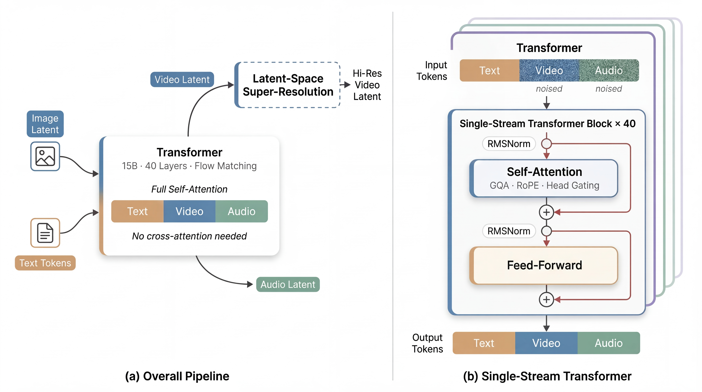

-----

<div align="center">

# daVinci-MagiHuman

### Speed by Simplicity: A Single-Stream Architecture for Fast Audio-Video Generative Foundation Model

<p align="center">
  <a href="https://plms.ai">SII-GAIR</a> &nbsp;&amp;&nbsp; <a href="https://sand.ai">Sand.ai</a>
</p>

[](https://arxiv.org/abs/2603.21986)
[](https://huggingface.co/spaces/SII-GAIR/daVinci-MagiHuman)
[](https://huggingface.co/GAIR/daVinci-MagiHuman)
[](https://opensource.org/licenses/Apache-2.0)
[](https://www.python.org/)
[](https://pytorch.org/)

</div>

## 🆕 Recent Updates

- Added example scripts for `T2V`, `TI2V`, `TA2V`, and `TIA2V` across `base`, `distill`, `sr_540p`, and `sr_1080p`.
- Added clearer usage guidance for `base`, `distill`, `sr_540p`, and `sr_1080p`, including input modes, default resolutions, and runtime script knobs.
- Added optional low-memory runtime settings for consumer GPUs, including runtime CPU offload, MagiCompiler offload, context parallel size, and optional `numactl` launch settings.
- Added more public prompt files for selected demos and expanded demo coverage across multiple tasks.
- Clarified supported image and audio input formats.

## ✨ Highlights

- 🧠 **Single-Stream Transformer** — A unified 15B-parameter, 40-layer Transformer that jointly processes text, video, and audio via self-attention only. No cross-attention, no multi-stream complexity.
- 🎭 **Exceptional Human-Centric Quality** — Expressive facial performance, natural speech-expression coordination, realistic body motion, and accurate audio-video synchronization.
- 🌍 **Multilingual** — Supports Chinese (Mandarin & Cantonese), English, Japanese, Korean, German, and French.
- ⚡ **Blazing Fast Inference** — Generates a 5-second 256p video in **2 seconds** and a 5-second 1080p video in **38 seconds** on a single H100 GPU.
- 🏆 **State-of-the-Art Results** — Achieves **80.0%** win rate vs Ovi 1.1 and **60.9%** vs LTX 2.3 in pairwise human evaluation over 2,000 comparisons.
- 📦 **Fully Open Source** — We release the complete model stack: base model, distilled model, super-resolution model, and inference code.

## 🎬 Demo Gallery

### Featured Demos

https://github.com/user-attachments/assets/7050a191-38ef-4e36-8b48-0084ccc694f1

https://github.com/user-attachments/assets/c6cc056f-56ca-4285-80f3-bb6052228d23

<table>
<tr valign="top">
<td width="33%"><video src="https://github.com/user-attachments/assets/584d4e13-9956-4ef0-8867-2c78efeac5aa" controls muted width="100%"></video></td>
<td width="33%"><video src="https://github.com/user-attachments/assets/c5f87f3a-f121-4f34-8d41-8c4b1c24b5e6" controls muted width="100%"></video></td>
<td width="33%"><video src="https://github.com/user-attachments/assets/0fb467e8-e3a4-4155-9d6b-10b2e018bd7f" controls muted width="100%"></video></td>
</tr>
</table>
<table>
<tr valign="top">
<td width="50%"><video src="https://github.com/user-attachments/assets/956d55ce-72cf-4dd4-a29e-ea2c3f725864" controls muted width="100%"></video></td>
<td width="50%"><video src="https://github.com/user-attachments/assets/7db9db31-617e-44a6-b2df-99d47accba22" controls muted width="100%"></video></td>
</tr>
</table>

### T2V Demos

Add future `T2V` examples here. For each video, we recommend linking the corresponding prompt file in `example/assets/`.

### TI2V Demos

Add future `TI2V` examples here. For each video, we recommend linking both the prompt file and the reference first-frame image when available.

### TA2V Demos

Add future `TA2V` examples here. For each video, we recommend linking the prompt file and the reference audio source.

### TIA2V Demos

Add future `TIA2V` examples here. For each video, we recommend linking the prompt file and specifying the reference image and audio source.

## 🏗️ Architecture

<div align="center">

</div>

daVinci-MagiHuman uses a single-stream Transformer that takes text tokens, an optional reference image latent, and noisy video and audio tokens as input, and jointly denoises the video and audio within a unified token sequence.

Key design choices:

| Component | Description |
|---|---|
| 🥪 **Sandwich Architecture** | First and last 4 layers use modality-specific projections; middle 32 layers share parameters across modalities |
| 🕐 **Timestep-Free Denoising** | No explicit timestep embeddings — the model infers the denoising state directly from input latents |
| 🔀 **Per-Head Gating** | Learned scalar gates with sigmoid activation on each attention head for training stability |
| 🔗 **Unified Conditioning** | Denoising and reference signals handled through a minimal unified interface — no dedicated conditioning branches |

## 📊 Performance

### Quantitative Quality Benchmark

| Model | Visual Quality ↑ | Text Alignment ↑ | Physical Consistency ↑ | WER ↓ |
|---|:---:|:---:|:---:|:---:|
| OVI 1.1 | 4.73 | 4.10 | 4.41 | 40.45% |
| LTX 2.3 | 4.76 | 4.12 | **4.56** | 19.23% |
| **daVinci-MagiHuman** | **4.80** | **4.18** | 4.52 | **14.60%** |

### Human Evaluation (2,000 Pairwise Comparisons)

| Matchup | daVinci-MagiHuman Win | Tie | Opponent Win |
|---|:---:|:---:|:---:|
| vs Ovi 1.1 | **80.0%** | 8.2% | 11.8% |
| vs LTX 2.3 | **60.9%** | 17.2% | 21.9% |

### Inference Speed (5-second video, on a single H100 GPU)

| Resolution | Base (s) | Super-Res (s) | Decode (s) | **Total (s)** |
|---|:---:|:---:|:---:|:---:|
| 256p | 1.6 | — | 0.4 | **2.0** |
| 540p | 1.6 | 5.1 | 1.3 | **8.0** |
| 1080p | 1.6 | 31.0 | 5.8 | **38.4** |

## 🚀 Efficient Inference Techniques

- ⚡ **Latent-Space Super-Resolution** — Two-stage pipeline: generate at low resolution, then refine in latent space, avoiding an extra VAE decode-encode round trip.
- 🔄 **Turbo VAE Decoder** — A lightweight re-trained decoder that substantially reduces decoding overhead.
- 🔧 **Full-Graph Compilation** — [MagiCompiler](https://github.com/SandAI-org/MagiCompiler) fuses operators across Transformer layers for ~1.2x speedup.
- 💨 **Distillation** — DMD-2 distillation enables generation with only 8 denoising steps (no CFG), without sacrificing quality.

## 📦 Getting Started

### Option 1: Docker (Recommended)

```bash
# Recommended: use the prebuilt MagiHuman image (supports full pipeline including SR 1080p)
docker pull sandai/magi-human:latest

docker run -it --gpus all --network host --ipc host \
  -v /path/to/repos:/workspace \
  -v /path/to/checkpoints:/models \
  --name my-magi-human \
  sandai/magi-human:latest \
  bash

# Install MagiCompiler
git clone https://github.com/SandAI-org/MagiCompiler.git
cd MagiCompiler
pip install -r requirements.txt
pip install .
cd ..

# Clone daVinci-MagiHuman
git clone https://github.com/GAIR-NLP/daVinci-MagiHuman
cd daVinci-MagiHuman
```

If you prefer manual setup, follow Option 2 (Conda) below.

### Option 2: Conda

```bash
# Create environment
conda create -n davinci-magihuman python=3.12
conda activate davinci-magihuman
conda install ffmpeg

# Install PyTorch
pip install torch==2.10.0 torchvision==0.25.0 torchaudio==2.10.0

# Install Flash Attention (Hopper)
git clone https://github.com/Dao-AILab/flash-attention
cd flash-attention/hopper && python setup.py install && cd ../..

# Install MagiCompiler
git clone https://github.com/SandAI-org/MagiCompiler.git
cd MagiCompiler
pip install -r requirements.txt
pip install .
cd ..

# Clone and install daVinci-MagiHuman
git clone https://github.com/GAIR-NLP/daVinci-MagiHuman
cd daVinci-MagiHuman
pip install -r requirements.txt
pip install --no-deps -r requirements-nodeps.txt

# Optional (only for sr-1080p): Install MagiAttention
git clone --recursive https://github.com/SandAI-org/MagiAttention.git
cd MagiAttention
git checkout v1.0.5
git submodule update --init --recursive
pip install -r requirements.txt
pip install --no-build-isolation .
```

### Download Model Checkpoints

Download the complete model stack from [HuggingFace](https://huggingface.co/GAIR/daVinci-MagiHuman) and update the paths in the config files under `example/`.

You will also need the following external models:

| Model | Source |
|---|---|
| Text Encoder | [t5gemma-9b-9b-ul2](https://huggingface.co/google/t5gemma-9b-9b-ul2) |
| Audio Model | [stable-audio-open-1.0](https://huggingface.co/stabilityai/stable-audio-open-1.0) |
| VAE | [Wan2.2-TI2V-5B](https://huggingface.co/Wan-AI/Wan2.2-TI2V-5B) |

## 🎯 Usage

Before running, update the checkpoint paths in the config files (`example/*/config.json`) to point to your local model directory.

> **Note:** The first run will be slower due to model compilation and cache warmup. Subsequent runs will match the reported inference speeds.

### Run Scripts

**Base Model (256p)**
```bash
bash example/base/run_T2V.sh   # T2V
bash example/base/run_TI2V.sh  # TI2V
bash example/base/run_TA2V.sh  # TA2V
bash example/base/run_TIA2V.sh # TIA2V
```

**Distilled Model (256p, 8 steps, no CFG)**
```bash
bash example/distill/run_T2V.sh
bash example/distill/run_TI2V.sh
bash example/distill/run_TA2V.sh
bash example/distill/run_TIA2V.sh
```

**Super-Resolution to 540p**
```bash
bash example/sr_540p/run_T2V.sh
bash example/sr_540p/run_TI2V.sh
bash example/sr_540p/run_TA2V.sh
bash example/sr_540p/run_TIA2V.sh
```

**Super-Resolution to 1080p**
```bash
bash example/sr_1080p/run_T2V.sh
bash example/sr_1080p/run_TI2V.sh
bash example/sr_1080p/run_TA2V.sh
bash example/sr_1080p/run_TIA2V.sh
```

### Modes

- `T2V`: prompt only
- `TI2V`: prompt + image
- `TA2V`: prompt + audio
- `TIA2V`: prompt + image + audio

### Inputs

- Edit `PROMPT_PATH`, `IMAGE_PATH`, and `AUDIO_PATH` near the top of each script.
- Default `T2V` prompt file: `example/assets/video8.txt`
- Default `TI2V` prompt and image: `example/assets/prompt.txt` and `example/assets/image.png`
- Default `TA2V` prompt and audio: `example/assets/video11.txt` and `example/assets/video11.mp3`
- Default `TIA2V` prompt, image, and audio: `example/assets/video10.txt`, `example/assets/video10.jpeg`, and `example/assets/video10.ogg`

### Resolution

- `base` and `distill` default to `448x256`.
- `sr_540p` defaults to `448x256 -> 896x512`.
- `sr_1080p` defaults to `448x256 -> 1920x1088`.
- `br_width` / `br_height`: base generation resolution
- `sr_width` / `sr_height`: super-resolution target, only used by `sr_540p` and `sr_1080p`
- For portrait, swap width and height in the same script.

### File Formats

- Images are loaded with `diffusers.utils.load_image(...)`. Recommended formats: `png`, `jpg`, `jpeg`. Common `webp` and `bmp` should also work.
- Audio is loaded with `whisper.load_audio(...)` through local `ffmpeg`. Recommended formats: `wav`, `mp3`. Common `m4a`, `aac`, `flac`, and `ogg` should also work.

### CPU Offload

For low-memory GPUs such as RTX 4090 / 48GB-class cards, the `base` scripts expose a simple all-offload setup near the top of each script:

```bash
CPU_OFFLOAD="${CPU_OFFLOAD:-true}"
ENABLE_MAGI_COMPILER_OFFLOAD="${ENABLE_MAGI_COMPILER_OFFLOAD:-true}"
GPU_RESIDENT_WEIGHT_RATIO="${GPU_RESIDENT_WEIGHT_RATIO:-0.35}"
OFFLOAD_POLICY="${OFFLOAD_POLICY:-HEURISTIC}"
CP_SIZE="${CP_SIZE:-${GPUS_PER_NODE}}"
LAUNCH_PREFIX="${LAUNCH_PREFIX:-numactl --interleave=all}"
```

With this all-offload setup, the target is to keep `sr_1080p` under `48GB` VRAM and `base` under `20GB` VRAM on 48GB-class GPUs.

- `CPU_OFFLOAD`: runtime low-memory path.
- `ENABLE_MAGI_COMPILER_OFFLOAD`: enables MagiCompiler model offload.
- `GPU_RESIDENT_WEIGHT_RATIO`: lower values save more GPU memory, but are usually slower.
- `OFFLOAD_POLICY`: MagiCompiler offload policy. Keep `HEURISTIC` unless you need something else.
- `CP_SIZE`: context parallel size. In most cases, leave it equal to `GPUS_PER_NODE`.
- `LAUNCH_PREFIX`: optional launcher prefix, mainly used for `numactl`.

For `base`, this is the recommended starting point on 4090 / 48GB-class GPUs before changing anything deeper in the code.

## ✍️ Prompt Guidance
 
daVinci-MagiHuman uses an **Enhanced Prompt** system that rewrites user inputs into detailed performance directions optimized for avatar-style video generation. For the full system prompt specification, see [`prompts/enhanced_prompt_design.md`](prompts/enhanced_prompt_design.md).

Below is a quick reference for writing effective prompts.

### Output Structure
 
Every enhanced prompt has **three parts**:
 
1. **Main Body** (150–200 words) — A clinical, chronological description of the character's appearance, facial dynamics, vocal delivery, and static cinematography. Written in English regardless of dialogue language.
 
2. **Dialogue** — Repeats all spoken lines in a structured format:
   ```
   Dialogue:
   <character description, language>: "Line content"
   ```
 
3. **Background Sound** — Specifies the most prominent ambient sound:
   ```
   Background Sound:
   <Description of the background sound>
   ```
   Use `<No prominent background sound>` if none.

### Quick Example
 
**User input:** A man in a yellow shirt says "有的人在一起生活一辈子，还带着假面具呢"
 
**Enhanced prompt (abbreviated):**
 
> A young man with short dark hair, wearing a bright yellow polo shirt, sits stationary. His disposition is earnest and slightly agitated... He speaks with a rapid, emphatic tone, his mouth opening wide as he says, "有 的 人 在 一 起 生 活 一 辈 子，还 带 着 假 面 具 呢..." His brow furrows, lip muscles showing distinct dynamics...
>
> Dialogue:
> \<Young man in yellow polo, Mandarin\>: "有 的 人 在 一 起 生 活 一 辈 子，还 带 着 假 面 具 呢..."
>
> Background Sound:
> \<No prominent background sound\>

## 🙏 Acknowledgements

We thank the open-source community, and in particular [Wan2.2](https://github.com/Wan-Video/Wan2.2) and [Turbo-VAED](https://github.com/hustvl/Turbo-VAED), for their valuable contributions.

## 📄 License

This project is released under the [Apache License 2.0](https://opensource.org/licenses/Apache-2.0).

## 📖 Citation

```bibtex
@article{davinci-magihuman-2026,
  title={Speed by Simplicity: A Single-Stream Architecture for Fast Audio-Video Generative Foundation Model},
  author={SII-GAIR and Sand. ai and Chern, Ethan and Teng, Hansi and Sun, Hanwen and Wang, Hao and Pan, Hong and Jia, Hongyu and Su, Jiadi and Li, Jin and Yu, Junjie and Liu, Lijie and Li, Lingzhi and Ye, Lyumanshan and Hu, Min and Wang, Qiangang and Qi, Quanwei and Chern, Steffi and Bu, Tao and Wang, Taoran and Xu, Teren and Zhang, Tianning and Mi, Tiantian and Xu, Weixian and Zhang, Wenqiang and Zhang, Wentai and Yi, Xianping and Cai, Xiaojie and Kang, Xiaoyang and Ma, Yan and Liu, Yixiu and Zhang, Yunbo and Huang, Yunpeng and Lin, Yutong and Tao, Zewei and Liu, Zhaoliang and Zhang, Zheng and Cen, Zhiyao and Yu, Zhixuan and Wang, Zhongshu and Hu, Zhulin and Zhou, Zijin and Guo, Zinan and Cao, Yue and Liu, Pengfei},
  journal={arXiv preprint arXiv:2603.21986},
  year={2026}
}
```
